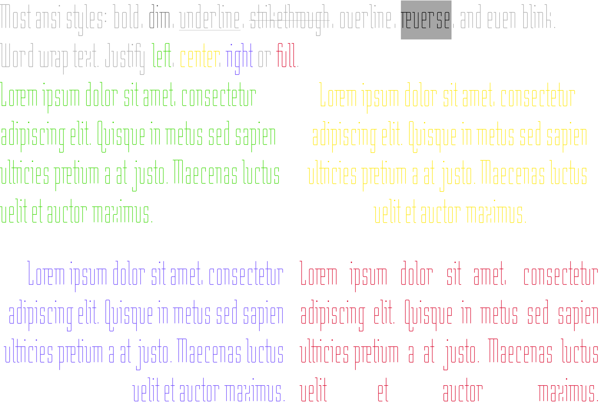

[](https://github.com/mtkalms/rich-typography/actions/workflows/python-package.yml)
[](https://github.com/mtkalms/rich-typography/actions/workflows/ruff-format.yml)
[](https://github.com/mtkalms/rich-typography/actions/workflows/gh-pages.yml)

# rich-typography
Large letter typography for [Rich](https://github.com/Textualize/rich) and [Textual](https://github.com/Textualize/textual).



## Installation

Install with `uv` or your favorite PYPI package manager:

```bash
uv add rich-typography
```

## Usage

```python
from rich.console import Console
from rich_typography import Typography

console = Console()
text = Typography.from_markup("Hello from [purple]rich-typography[/purple]")
console.print(text)
```


### Custom Markdown

Rich allows you to create your own Markdown renderable and overwrite how specific markdown blocks are rendered.
With that we can modify [this example](https://rich.readthedocs.io/en/latest/markdown.html) to render H1 headings as `Typography` instead of `Text`.

```python
from rich.markdown import Markdown as RichMarkdown, Heading as RichHeading
from rich.console import Console, RenderResult
from rich_typography import Typography


MARKDOWN = """
# This is an h1

Rich can do a pretty *decent* job of rendering markdown.

## This is an h2

1. This is a list item
2. This is another list item
"""


class Heading(RichHeading):
    def __rich_console__(self, *args, **kwargs) -> RenderResult:
        self.text.style = "red"
        if self.tag == "h1":
            text = Typography.from_text(self.text)
            text.justify = "center"
            yield text
        else:
            yield from super().__rich_console__(*args, **kwargs)


class Markdown(RichMarkdown):
    def __init__(self, *args, **kwargs) -> None:
        super().__init__(*args, **kwargs)
        self.elements["heading_open"] = Heading


output = Markdown(MARKDOWN)
```


## Similar Projects

- [rich-pyfiglet](https://github.com/edward-jazzhands/rich-pyfiglet)
- [textual-pyfiglet](https://github.com/edward-jazzhands/textual-pyfiglet)